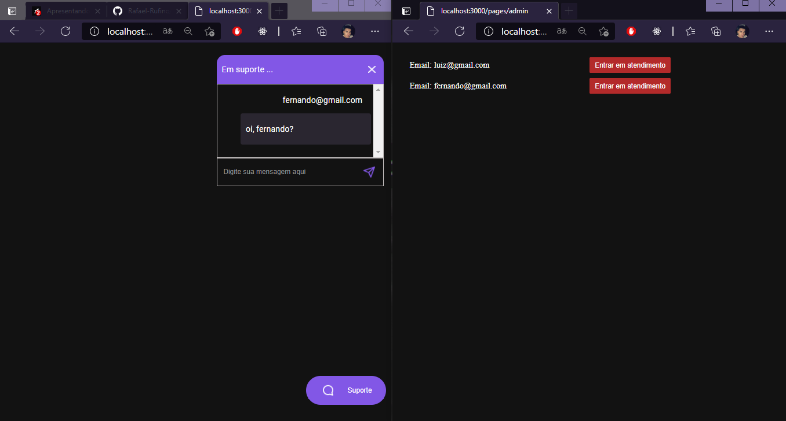
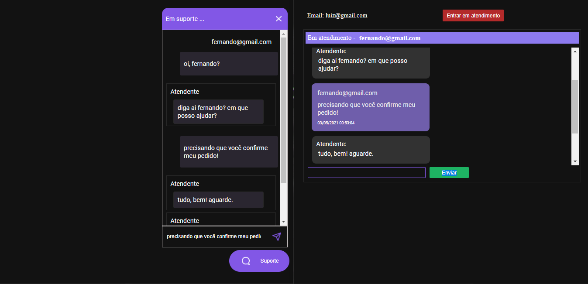

<h3 align="center">
    <b>Chatty</b>  
    <br>
</h3>


- [Sobre](#sobre)
- [Tecnologias Utilizadas](#tecnologias-utilizadas)
- [Como Usar](#como-usar)
- [Como Contribuir](#como-contribuir)

<a id="sobre"></a>


## :bookmark: Sobre

O <strong>Chatty</strong> é uma aplicação de chat para atendimento ao clientes em tempo real.

Essa aplicação foi construída na trilha durante o <strong> Next Level Week #05</strong> distribuída pela Rocketseat.


<a id="tecnologias-utilizadas"></a>

## :rocket: Tecnologias Utilizadas

O projeto foi desenvolvido utilizando as seguintes tecnologias


- [Node.js](https://nodejs.org/en/)
- [TypeScript](https://www.typescriptlang.org/)
- [Express](https://expressjs.com/pt-br/)
- [Socket.io](https://socket.io/)


## :heavy_check_mark: :computer: Resultado Web

<h1 align="center">
    
    <br>
    

</h1>


<a id="como-usar"></a>

## :fire: Como usar

- ### **Pré-requisitos**

  - É **necessário** possuir o **[Node.js](https://nodejs.org/en/)** instalado na máquina
  - Também, é **preciso** ter um gerenciador de pacotes seja o **[NPM](https://www.npmjs.com/)** ou **[Yarn](https://yarnpkg.com/)**.
  - Por fim, é **essencial** ter o **[Expo](https://expo.io/)** 
  instalado de forma global na máquina.


1. Faça um clone :

```sh
  git clone https://github.com/Rafael-Rufino/NLW-05_TrilhaNodeJs.git
```

2. Executando a Aplicação:

```sh
  # Instale as dependências
  $ npm install
  # or
  $ yarn install


  ## Crie o banco de dados
  $ cd NLW-05_TrilhaNodeJs
  $ npm typeorm migration:run
  $ yarn typeorm migration:run


  # Inicie a aplicação web
  $ cd NLW-05_TrilhaNodeJs
  $ npm run dev
  # or 
  $ yarn dev


  
  # Acessar o Servidor no Navegador
  $ http://localhost:3000


 
  # Porta de Acesso Liberado
  $ 3000


```
  


## :recycle: Como contribuir

- Faça um Fork desse repositório,
- Crie uma branch com a sua feature: `git checkout -b my-feature`
- Commit suas mudanças: `git commit -m 'feat: My new feature'`
- Push a sua branch: `git push origin my-feature`


🎓 **Quem ministrou?**

As aulas foram ministradas pelo mestre Daniele Evagelista - Instructor - Rocketseat nas aulas da Next Level Week.

📝 **License**

Esse projeto está sob a licença MIT. Veja o arquivo [LICENSE](LICENSE.md) para mais detalhes.


<h4 align="center">
    Feito com 💜 by <a href="https://www.linkedin.com/in/rafael-r-dos-santos-b889311ba/" target="_blank">Rafael Rufino</a>
</h4>


